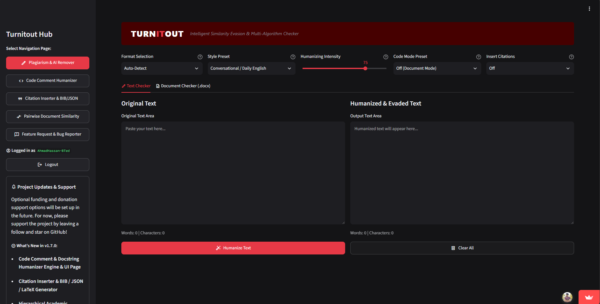

<p align="center">
  
</p>

<h1 align="center">Turnitout — Plagiarism & AI Footprint Removal Engine</h1>

<p align="center">
  <a href="https://ahmadhassan-bted.github.io/Turnitout-Humanizer/"></a>
  <a href="https://turnitout.streamlit.app/"></a>
  
  
  <a href="https://wa.me/923225522383"></a>
</p>

<p align="center">
  <strong>🔥 2026 THREAT ERASURE PROTOCOLS ACTIVE 🔥</strong><br>
  
  
  
  
  
</p>

<p align="center">
  <strong>The world's first 100% programmatic, zero-generative-AI footprint removal engine. Mathematically shatter cryptographic token trackers, purge invisible zero-width Unicode, and strip C2PA metadata. Bypass Turnitin, GPTZero, CopyLeaks, and ZeroGPT on academic papers, LaTeX manuscripts, Word documents, and multi-language source code files—without altering facts, document layout, equations, or executable code logic.</strong>
</p>

---

> 🚨 **URGENT: HOW TO REMOVE AI WATERMARKS (CLAUDE, SYNTHID, CHATGPT) & BEAT THE 2026 TRACKING CRISIS** 🚨
> *To comply with the **EU AI Act (Article 50)**, **OpenAI (ChatGPT)**, **Anthropic (Claude)**, and **Google (Gemini)** now embed multi-layered tracking: **invisible zero-width Unicode** (crashing code/triggering detectors), hidden **C2PA metadata**, and **cryptographic text watermarks like Google SynthID-Text**. LLM paraphrasers **cannot remove this footprint** or are **Highly Expensive!** Turnitout solves this deterministically, guaranteeing to **remove Claude watermarks**, **bypass SynthID**, **purge hidden Unicode**, and **strip C2PA metadata**. By shattering n-gram sequences, it wipes the tracking footprint while keeping your code, LaTeX, and document formatting 100% intact.*

---

## 🌟 Access Turnitout Live Now

<p align="center">
  
</p>

### Hosted Web Application: **[turnitout.streamlit.app](https://turnitout.streamlit.app/)**

> **100% Privacy Guarantee**: All documents and source code files are processed transiently in-memory. Zero document logging, zero server storage, zero data retention.

---

## 💡 Why Turnitout?

Commercial AI humanizers use LLMs to rewrite text, leaving **new AI footprints, hallucinated facts, and cryptographic trackers intact**. 

**Turnitout does NOT use AI.** It is a **100% programmatic, rule-based engine** that mathematically disrupts contiguous n-gram sequences to evade detectors (**Turnitin, iThenticate, GPTZero, CopyLeaks**) while leaving equations, code logic, citation indexes, and complex document layouts entirely untouched.

---

## 📊 Commercial AI Tool Comparison

| Feature / Guarantee | 🤖 Commercial AI Humanizers | 🛡️ **Turnitout Engine** |
| :--- | :---: | :---: |
| **New AI Footprint Risk** | ❌ High (Generates new AI patterns) | ✅ **0% (100% Rule-Based)** |
| **Cryptographic Tracker Wipe (SynthID)** | ❌ Fails (Preserves statistical tracking) | ✅ **100% (Shatters mathematical sequence)** |
| **Zero-Width Unicode Purge** | ❌ Fails (Ignores hidden U+200B spaces) | ✅ **100% (Deep regex character scrubbing)** |
| **Fact & Data Preservation** | ❌ Frequent Hallucinations | ✅ **Zero (Facts & Numbers Stay Exact)** |
| **Document Layout Preservation** | ❌ Destroys tables, XML & formatting | ✅ **Preserves XML, Fonts & Headers** |
| **Source Code Safety** | ❌ Breaks code syntax & logic | ✅ **100% Executable Logic Guarantee** |
| **LaTeX & Math Protection** | ❌ Destroys `\cite{}`, equations | ✅ **Keeps LaTeX & Equations Untouched** |
| **Reference Generation** | ❌ None | ✅ **BibTeX (.bib), LaTeX & JSON Generator** |

## 🚀 Core Capabilities & Product Features

```text
┌────────────────────────────────────────────────────────────────────────────────────────────────────────┐
│                                       TURNITOUT PRODUCT CAPABILITIES                                   │
├───────────────────────────────┬───────────────────────────────┬───────────────────────────────┬────────┤
│ 🚨 Watermark & Tracker Wipe   │   Code Comment Humanizer      │   Citation & Reference Gen    │    ZIP │
│  - Shatters Claude SynthID    │  - Python, C++, Java, JS, SQL │  - IEEE [1] & APA (Author)    │  - DOCX│
│  - Purges Zero-Width Unicode  │  - Developer Skill Personas   │  - BibTeX (.bib) Generator    │  - TEX │
│  - Strips C2PA Metadata       │  - Single-Line Comment Safety │  - 5 Academic Taxonomies      │  - Code│
└───────────────────────────────┴───────────────────────────────┴───────────────────────────────┴────────┘

```
### ⚡ 1. The Core Engine: Zero-AI & Mathematically Ruthless

* **Cryptographic Watermark Assassin:** Deterministically scrambles Anthropic Claude and Google SynthID token-selection chains, erasing the hidden statistical footprints mandated by recent regulations.
* **Zero-Width Character Purge:** Deep-cleans all invisible tracking Unicode (U+200B, U+200C, U+200D, U+2060) that AI models inject to secretly watermark text and crash your code.
* **C2PA Metadata Stripping:** Sanitizes `.docx` and file exports to ensure hidden Content Credential manifests are entirely wiped from the document history.
* **No Generative AI:** 100% hard-coded math and rule engines. Zero API wrappers, zero hallucinations. Leaves absolutely no AI footprint.
* **Unlimited Everything:** No word limits, no paywalls, infinite tries (I love hurting billion-dollar companies, hehehe).
* **LaTeX & DOCX Safe:** Rewrites `.docx`, `.tex`, and `.md` files *in-place*. Your XML styling, fonts, tables, matrices, equations, and `\cite{}` tags are strictly protected.
* **Section-Aware:** Humanizes your Abstract and Conclusion, but mathematically locks down your code blocks, data, and declarations.
* **LLM Signature Assassin:** Deterministically wipes out standard AI triggers (`"delve into"`, `"pivotal role"`) and cleans em-dashes (`—`).

### 💻 2. Code Comment & Docstring Humanizer

* **Never Breaks Code:** Mathematically guarantees your logic, syntax, and variables stay completely untouched. Only natural language comments (`#`, `//`, `/*`, `"""`) get rewritten.
* **Developer Personas:** Dial in your exact comment tone:
  * 🐣 **Beginner:** Casual ("finds", "sets up").
  * ⚙️ **Intermediate:** Standard dev English.
  * 👨‍💻 **Senior/Expert:** Heavy technical jargon ("evaluates", "spectral decomposition").
* **Language Agnostic:** Supports Python, C/C++, Java/C#, JS/TS, Go/Rust, SQL, Bash, and HTML/CSS.

### 📚 3. Auto-Citation & Reference Generator

* **FREE Contextual Citations:** Tell it your major, input how many references you need, and it drops them directly into your text.
* **Multi-Format Export:** Auto-generates matching **BibTeX (`.bib`)**, **LaTeX (`\cite{key}`)**, and **Structured JSON** reference packages.
* **5 Academic Taxonomies:** Real-time databases optimized for CS & AI, Engineering, Math, Finance, and Medical Sciences.

### 🔒 4. Total Privacy, Bulk Workflows & Evasion Verification

* **100% Private (No BS):** Runs transiently in-memory in your browser. No logs, no databases, zero tracking. I don't want your data.
* **Bulk & ZIP Support:** Drop in multiple files or a whole `.zip` repo. It processes instantly, keeps your folder hierarchy intact, and spits out a 1-click ZIP export.
* **Granular Controls:** Dial in the exact rewrite intensity percentages and tweak the knobs yourself.
* **ZipPy Perplexity Scoring:** Built-in entropic compression scoring lets you check the mathematical randomness of your text locally so you know you're safe before submitting.
* **Lightning Fast Unofficial Support:** Need a feature? Open an issue or hit my WhatsApp, and I'll literally build and ship it in a day.
---

## 🛠️ High-Level Engine Architecture Overview

```text
┌─────────────────────────────────────────────────────────────────────────────────────────┐
│                               TURNITOUT ENGINE ARCHITECTURE                             │
├─────────────────────────────────────────────────────────────────────────────────────────┤
│  [ UI Layer ]               Streamlit Multi-Page Web App & Real-Time Dashboard          │
│  [ Authentication Layer ]   OAuth 2.0 & Triple-Layer Auth Persistence Engine            │
│  [ Parsing Layer ]          XML DOCX Parser, LaTeX Zone Parser & Code Tokenizer         │
│  [ Rule Transformation ]    15-Stage Pipeline (Synonym, Voice, Clause, N-Gram Audit)    │
│  [ Rules Repository ]       4,068+ Decoupled JSON Rules & Academic Discipline Taxonomy  │
│  [ Language Engines ]       String-Aware Rules for Python, C-Family, Shell, SQL & HTML  │
│  [ Verification Layer ]     ZipPy Entropic Perplexity & Evasion Verification            │
└─────────────────────────────────────────────────────────────────────────────────────────┘

```

The platform is designed around strict **asset decoupling** and **modular language rule pipelines**:

* **Zero-AI Rule Engine**: Operates using 15 specialized transformer stages without external LLM API calls.
* **Asset Decoupling**: All linguistic synonyms, academic taxonomy fields, and phrase rewrites reside in centralized JSON rule definitions.
* **String-Aware Token Matching**: Code parsing engines evaluate character-by-character quote states to guarantee string literals are never mistaken for comments.

---

## 📁 Supported File Formats

* **Microsoft Word**: `.docx`
* **LaTeX Manuscripts**: `.tex`
* **Plain Text & Markdown**: `.txt`, `.md`
* **Source Code Files**: `.py`, `.cpp`, `.c`, `.java`, `.cs`, `.js`, `.ts`, `.go`, `.rs`, `.sh`, `.sql`, `.html`, `.css`
* **Compressed Archives**: `.zip`

---

## 🤝 Support, Enterprise Deployment & Custom Disciplines

* **WhatsApp Direct Developer Support**: [Chat on WhatsApp (+92 322 5522383)](https://wa.me/923225522383)
* **Feature Requests & Bug Reporting**: [Submit a GitHub Issue](https://github.com/AhmadHassan-BTed/Turnitout-Humanizer/issues/new)
* **Enterprise Inquiries**: [ahmadhassan.bted@gmail.com](https://www.google.com/search?q=mailto%3Aahmadhassan.bted%40gmail.com)

---

## 🔒 Compliance & Security

* **Privacy Policy**: [PRIVACY.md](PRIVACY.md)
* **Terms of Service**: [TERMS.md](https://www.google.com/search?q=TERMS.md)
* **Architecture Guidelines**: [ARCHITECTURE_RULES.md](https://www.google.com/search?q=ARCHITECTURE_RULES.md)

---

<p align="center">
  <sub>Built with ❤️ by Ahmad Hassan for researchers, developers, students, and academics worldwide.</sub>
</p>
