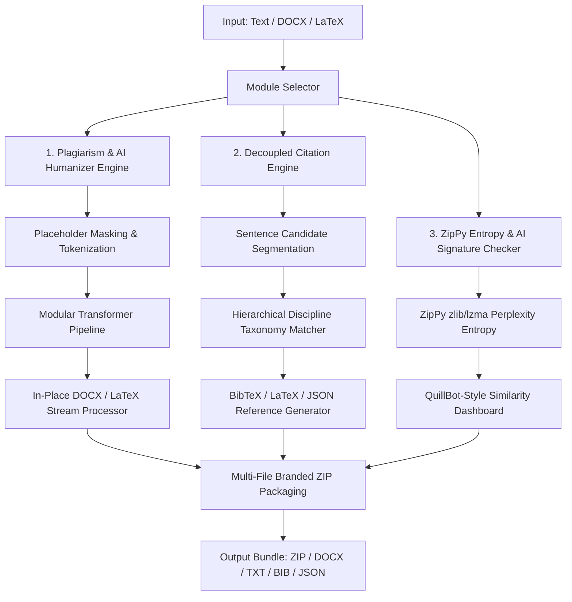

# System Architecture: Turnitout Core (v1.6.0)

Turnitout utilizes a deterministic, modular pipeline to reduce plagiarism and similarity indices in LaTeX and Word (`.docx`) documents. It prioritizes semantic preservation, syntax security, and hierarchical discipline citation placement.

---

## High-Level System Workflow

---

## Core Components Architecture

### 1. Decoupled Citation Engine (`turnitout.core.citation_engine`)
- Modular engine independent of main humanizer pipelines.
- **Hierarchical Discipline Resolution**: Scans sentences against categorized taxonomy rules (`rules/academic/taxonomy/*`):
  - `computer_science/`
  - `engineering_physics/`
  - `mathematics_statistics/`
  - `quantitative_finance/`
  - `medical_life_sciences/`
- **Citation Count**: Supports contextual auto-detection (`Auto`) or exact specified counts.
- **Reference Generators**: Outputs matching BibTeX (`citations.bib`), LaTeX (`\cite{key}`), and structured JSON metadata (`citations.json`).

### 2. Multi-File Stream Processor & ZIP Bundling (`turnitout.core.doc_processor`)
- Processes `.docx` files in-place while preserving images, tables, headers, footers, and XML typography intact.
- **In-Memory Bundler**: Generates stateless ZIP archives without disk cache leaks (`Turnitout_Humanized_Docs_<TIMESTAMP>.zip`, `Turnitout_Citations_<TIMESTAMP>.zip`, `Turnitout_Checker_Reports_<TIMESTAMP>.zip`).

### 3. Hierarchical Rules & Taxonomy Loader (`turnitout.core.rules`)
- Recursive directory loader (`load_academic_taxonomy()`) traversing `rules/academic/taxonomy/`.
- Validates and filters `__prompt__` metadata headers from all taxonomy JSON files on startup into `ACADEMIC_TAXONOMY`.

### 4. Text Modifier & Transformer Pipeline (`turnitout.core.modifier`)
- Operates on a character-level placeholder engine to temporarily mask LaTeX/formatting commands.
- Sequentially executes 16 transformation stages (Phrase Rewrites, Morphological Stemmed Synonyms, Clause Reordering, Determiner Swaps, Compound Splits, Voice Transforms, Sentence Fusion, Nominalization, Appositive Injection, Discourse Rotation).

### 5. UI Layer & Gate Bypass (`turnitout.ui`)
- **`humanizer_ui.py`**: Humanizer page with text areas and multi-file DOCX processing.
- **`citation_ui.py`**: Citation Inserter & BIB / JSON / LaTeX Generator page.
- **`feedback_ui.py`**: In-app Feature Request & Bug Reporter page (bypasses unlock gate).
- **`checker_ui.py`**: QuillBot-style stats dashboard and ZipPy AI detector.
